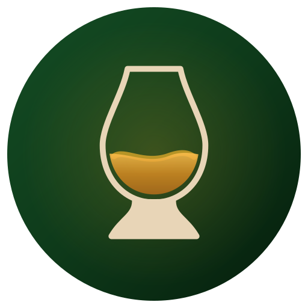

<div align="center">



# Aqua Vitaeum

### *Fine Spirits Tasting Journal & Sensory Analytics*

A digital codex forged for Single Malt Scotch, Bourbon, and fine spirits connoisseurs.  
Designed with dark vintage pub craftsmanship, interactive sensory radar profiling, and temporal finish modeling.

[](https://nextjs.org/)
[](https://www.typescriptlang.org/)
[](https://tailwindcss.com/)
[](https://web.dev/progressive-web-apps/)
[](https://vitest.dev/)

</div>

---

## 🥃 The 4 Pillars

```
┌───────────────────────────────┬───────────────────────────────┐
│  📖 Artisanal Tasting Journal │  🕸️ Dual-Layer Sensory Radar  │
│  Comprehensive spirit specs,  │  11-dimension comparative     │
│  distillery, cask type, ABV,  │  profiling: Nose Aromas vs.   │
│  and parchment notes ledger.  │  Palate Flavors in real time. │
├───────────────────────────────┼───────────────────────────────┤
│  ⏱️ 60s Finish Timeline Spline │  🏛️ Multi-View Cellar Vault   │
│  Cubic Bezier curves mapping  │  Seamless switching between   │
│  temporal flavor onset, peak  │  Photo Gallery, Compact List, │
│  intensity, and extinction.   │  and Sortable Matrix Table.   │
└───────────────────────────────┴───────────────────────────────┘
```

---

## 🎨 Sensory & Aesthetic Highlights

- **Dark Vintage Pub Atmosphere**: Crafted with aged dark walnut wood chrome (`.bg-wood`), smoked obsidian card surfaces, and aged ivory letterpress typography (`#E8D5B7`).
- **Precious Metal Rating Tiers**: 100-point scores render with authentic noble metal badges: **Radiant 24k Gold** (`≥90`), **Aged Brass** (`80–89`), **Toasted Copper Oak** (`70–79`), and **Aged Slate** (`<70`).
- **Instinctive Flavor Palette**: Descriptors map to natural sensory colors (e.g. *Peat Smoke* `#655A52`, *Sea Salt* `#2B788B`, *Green Apple* `#3E8E41`).
- **Offline-First & PWA**: High-capacity local storage via IndexedDB (Dexie.js) with client-side canvas compression for bottle photos and offline service worker caching.

---

## ⚡ Quickstart

```bash
# 1. Clone & install
git clone https://github.com/moujou/aquavitaeum.git
cd aquavitaeum
npm install

# 2. Run local development server
npm run dev

# 3. Quality checks
npm run type-check && npm run lint
```

---

## 📚 Documentation & Design System

- 🛠️ **Developer Setup & Architecture**: [`docs/DOCUMENTATION.md`](./docs/DOCUMENTATION.md)
- 🎨 **Visual Design System & CSS Tokens**: [`docs/DESIGN_SYSTEM.md`](./docs/DESIGN_SYSTEM.md)
- 📜 **AI Agent Directives & Steering**: [`AGENTS.md`](./AGENTS.md)

---

<div align="center">
  <sub>Copyright © 2026 Aqua Vitaeum. Built for fine spirits appreciation.</sub>
</div>
