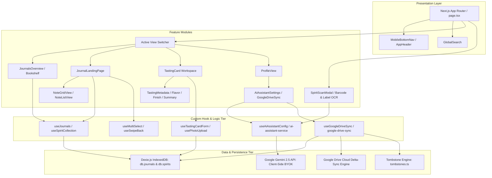

# 🏛️ Aqua Vitaeum — Architecture Documentation

This document describes the high-level system architecture, client-first storage strategy, modular subsystem decomposition, and security tiers of **Aqua Vitaeum**.

---

## 🗺️ Architectural Topology

Aqua Vitaeum is built as a **100% serverless, client-first static web application** executing entirely inside the user's browser with full offline capabilities.



---

## 💾 Client Storage Tier (Dexie.js IndexedDB)

To bypass the 5MB browser `localStorage` limits and guarantee persistence of high-resolution tasting notes and bottle photos, Aqua Vitaeum uses **IndexedDB** managed through **Dexie.js** (`src/lib/db.ts`).

### Database Schema Versions

* **Version 1**:
  - `spirits`: Primary key `id`. Indexes: `spiritType`, `distillery`, `name`, `rating100`.
* **Version 2**:
  - `journals`: Primary key `id`. Indexes: `name`, `createdAt`.
  - `spirits`: Adds `journalId` index for relational grouping by journal.

---

## 🧩 Modular Subsystem Decomposition

The codebase is organized into cleanly decoupled, single-responsibility feature domains:

```
src/
├── app/                              # Next.js App Router layout, page, and globals.css
├── components/
│   ├── features/
│   │   ├── collection/               # SpiritCard & NoteListItem presenters
│   │   ├── finish-diagram/           # Cubic Bezier finish time-intensity spline
│   │   ├── flavor-tags/              # Sensory compass drawer, spotlight search & tags
│   │   ├── journals/                 # JournalsOverview, JournalCoverPicker & landing
│   │   │   └── landing/layouts/      # NoteGridView (Card Feed) & NoteListView (Compact)
│   │   ├── navigation/               # AppHeader, MobileBottomNav
│   │   ├── photos/                   # SpiritPhotoCarousel, camera upload handlers
│   │   ├── profile/                  # ProfileView, GoogleDriveSyncSection, AiAssistantSettings
│   │   ├── radar-chart/              # Dual-layer 11-dimension sensory radar chart
│   │   ├── scanner/                  # SpiritScanModal, ScanBarcodeTab, ScanPhotoTab
│   │   ├── search/                   # GlobalSearch fuzzy search across journals & notes
│   │   ├── tasting-card/             # TastingCard workspace container
│   │   │   └── sections/             # Metadata, Flavor, Finish, Summary sections
│   │   └── welcome/                  # First-run onboarding experience
│   └── ui/                           # Primitive design components (ErrorBoundary, Sliders, Stars)
├── context/                          # LanguageContext (DE/EN) & GoogleDriveSyncContext
├── data/                             # 8-Category SWRI flavor taxonomy & mock datasets
├── hooks/                            # Dedicated React hooks (useJournals, useMultiSelect, etc.)
├── lib/                              # Domain utilities, db, tombstones, google-drive-sync
└── services/                         # ai-assistant-service.ts (Gemini API integration)
```

---

## 🧠 AI Assistant & Security Tier (Google Gemini 2.5)

Aqua Vitaeum implements a **100% Client-Side BYOK (Bring Your Own Key)** architecture:

- **Security & Privacy**:
  - The API key is entered by the user in Profile settings and persisted exclusively in the local browser `localStorage` (`aqua-vitaeum-gemini-key`).
  - No proxy servers or backend databases ever see or store the user's API key.
  - All prompt building, image payload encoding (Base64 JPEG), and JSON response parsing execute directly in the browser runtime via `src/services/ai-assistant-service.ts`.
- **Sensory Extraction**:
  - The AI service converts unstructured bottle labels into verified tasting schemas (`validateSpirit()`), generating 11-dimension radar profiles and flavor descriptors matched to our human-instinctive color taxonomy.

---

## ☁️ Google Drive Sync & Tombstone Architecture

The synchronization engine in `src/lib/google-drive-sync.ts` coordinates local IndexedDB records with remote Google Drive files:

1. **Two-Way Delta Sync**: Compares `updatedAt` timestamps between local and remote `.json` records. Newer modifications take precedence.
2. **Tombstone Engine (`src/lib/tombstones.ts`)**: Deletions recorded locally are stored in a persistent tombstone ledger (`aqua_vitaeum_tombstones_v1`). During synchronization, tombstoned items are deleted from Google Drive instead of being pulled back as "missing" items.
3. **Rogue-File Guard**: Remote files placed manually or by external programs are strictly validated against domain schemas (`src/lib/schemas/`). Unrecognized files are skipped without interrupting the sync cycle.
4. **Offline Export / Import**: High-integrity single-file backup (`.json`), individual journal export, and standalone spirit note exports with collision detection.

---

## 👆 Gesture & Multi-Select Engine

[`src/hooks/useMultiSelect.ts`](../src/hooks/useMultiSelect.ts) encapsulates collection selection logic:

- **Touch Long-Press (500ms Timer)**: Initiates selection mode with subtle haptic feedback (`navigator.vibrate(40)`).
- **Synthetic Click Suppression**: Cancels click triggers when a long-press finishes, preventing unintentional note navigation.
- **Bulk Operations**: Coordinates batch export and atomic multi-note deletion across journals.
- **Edge Swipe-Back (`useSwipeBack.ts`)**: Right-edge gesture listener navigating seamlessly back to the overview without interfering with native scroll interactions.

---

## 🖼️ Client-Side Image Compression Pipeline

[`src/hooks/usePhotoUpload.ts`](../src/hooks/usePhotoUpload.ts) ensures that user photos never cause storage or rendering bottlenecks:
- Images are decoded onto an offscreen `<canvas>`.
- Resized to a maximum bounding box of `1000px` (preserving aspect ratio).
- Compressed as JPEG at `0.85` quality.
- Shrinks raw 3–5MB mobile camera photos down to ~80–150KB before IndexedDB storage.
