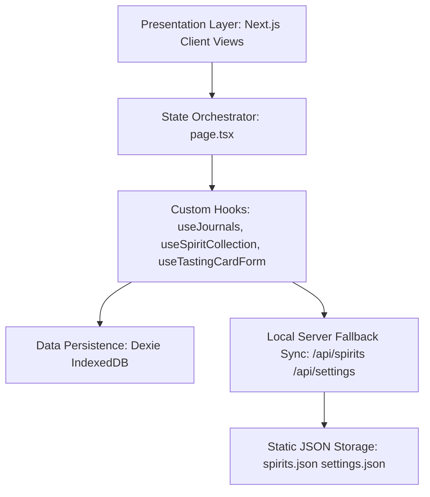

# 🏛️ Aqua Vitaeum — Architecture Documentation

This document describes the high-level system architecture, client-first storage strategy, state flow management, and key structural features of **Aqua Vitaeum**.

---

## 🗺️ Architectural Topology

Aqua Vitaeum is built as a client-first, server-fallback static application. It executes entirely inside the user's browser, enabling full offline capabilities.

---

## 💾 Client Storage Tier (Dexie IndexedDB)

To bypass the 5MB browser `localStorage` limits and prevent data loss, Aqua Vitaeum stores tasting records and journal structures directly in the browser's high-capacity **IndexedDB** using **Dexie.js**.

### Database Schema Versions

The schema is defined in [`src/lib/db.ts`](../src/lib/db.ts):

* **Version 1**:
  - `spirits`: Primary key `id`. Indexes: `spiritType`, `distillery`, `name`, `rating100`. (Stores flat collection items).
* **Version 2 (Migration upgrade)**:
  - Adds the `journals` table (keys: `id`, `name`, `createdAt`).
  - Adds `journalId` index to the `spirits` table to group spirits by journal.
  - Automatically migrates existing version 1 spirits by wrapping them inside a fallback `default-compendium` journal entry to preserve user data.

---

## 🔄 State Flow & Synchronization

The application implements a single-source-of-truth state orchestrator inside the home page component [`src/app/page.tsx`](../src/app/page.tsx):

- **View Switching**: Simulates layout routing through client-side active views (`activeView` state switching between `'welcome'`, `'overview'`, `'journal-detail'`, `'profile'`).
- **Top-Down Prop Injection**: Parent states (`activeJournalId`, `selectedId`, `globalSearchQuery`) flow down to component grids and detail forms.
- **Dynamic Stats Aggregation**: Journal statistics (total bottles, average rating, latest tasted dates, recent thumbnail images) are calculated on-the-fly when modifications in the spirits collection are saved.

---

## 🖼️ Canvas-Based Client-Side Image Compression

To prevent IndexedDB storage bloating and render performance lag from raw camera uploads (up to 5MB):
- The hook [`src/hooks/usePhotoUpload.ts`](../src/hooks/usePhotoUpload.ts) pipes FileReader results through a canvas-based resizer.
- Images are resized to a maximum boundary of `1000px` (preserving aspect ratio) and encoded as a JPEG with `0.85` quality.
- This compresses image uploads down to ~80-150KB before they are persisted as base64 Data URLs.

---

## 📱 Symmetrical Floating Action Buttons (FABs)

- **Bookshelf Overview**: Renders a floating creation FAB (`Plus` button) in the bottom-right corner (`absolute bottom-6 right-6 w-12 h-12`).
- **Journal Detail Workspace**: Renders symmetrical actions surrounding the Tasting Card container:
  - **Bottom-Left**: Back to Bookshelf (`BookOpen` button, `absolute bottom-6 left-6`).
  - **Bottom-Right**: Create tasting note (`Plus` button, `absolute bottom-6 right-6`).
- **Self-Aligning Coordinates**: Placed inside a relative wrapper context. The buttons automatically slide left/right as the sidebar collapses and expands.
