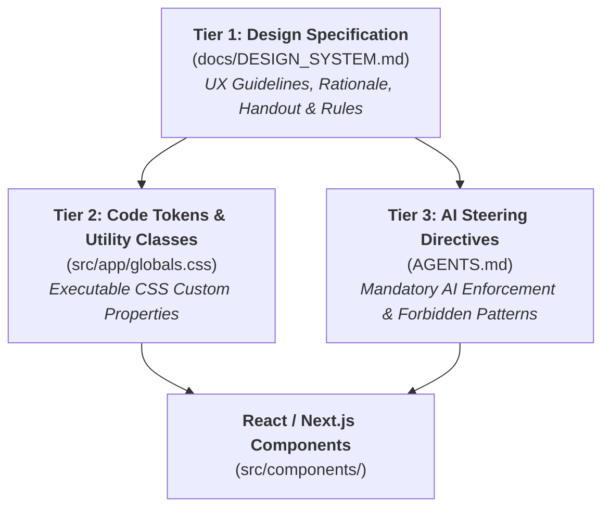
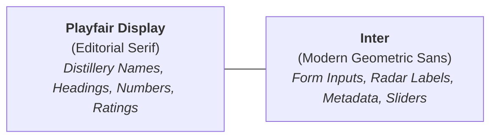

# 🎨 Aqua Vitaeum — Design System & Visual Specification

This document is the **Single Source of Truth (SSOT)** for all UI/UX design, visual aesthetics, color theory, typography pairings, elevation layers, and sensory matrices across **Aqua Vitaeum**.

---

## 🏛️ 1. Design Philosophy: The Irish Pub Aesthetic

Aqua Vitaeum is crafted around the sensory atmosphere of a **historic dark vintage Irish pub & tasting room**:

- **Dark Forest Green Atmosphere (`#122616`)**: Evoking vintage emerald velvet, deep moss walls, and dim pub corners.
- **Dark Walnut Wood Trim (`#311e15`)**: Rich, polished mahogany bar surfaces and bookshelf paneling textured with subtle organic grain.
- **Warm Polished Brass (`#C59B27`)**: Antique brass bar footrails, cask hoop rings, and warm lantern reflections acting as the primary interactive accent.
- **Aged Parchment (`#F5EEDC`)**: Heavy archival tasting notes, aged ledger paper, and historical distillery logbooks.
- **Aged Sepia Ink (`#1A120B`)**: Deep charcoal-brown ink written across parchment cards with clear typographic hierarchy.

---

## 📐 2. Architecture: The 3-Tier Design System



| Tier | File | Purpose |
| :--- | :--- | :--- |
| **Spec & Handout** | `docs/DESIGN_SYSTEM.md` | Human-readable & UX agent guide with design theory, color codes, contrast, and recipes. |
| **Code Implementation** | `src/app/globals.css` | CSS Custom Properties (`:root` / `[data-theme="pub-dark"]`) and compound utility classes. |
| **Agent Enforcement** | `AGENTS.md` | Mandatory steering directives preventing color drift and enforcing named token usage. |

---

## 🎨 3. Design Token Matrix

### 3.1 Pub Environment & Chrome

| Token Name | Hex Value | RGB / Alpha | Semantic Role & Surface |
| :--- | :--- | :--- | :--- |
| `--pub-bg` | `#122616` | `rgb(18, 38, 22)` | App root background, scrollable view areas. |
| `--pub-bg-alt` | `#1c3822` | `rgb(28, 56, 34)` | Secondary ambient depth on dark backgrounds. |
| `--pub-bg-panel` | `#224229` | `rgb(34, 66, 41)` | Elevated modals, filter dropdowns, dialogs. |
| `--wood-accent` | `#311e15` | `rgb(49, 30, 21)` | Nav bar background texture (`.bg-wood`). |
| `--wood-light` | `#442a1e` | `rgb(68, 42, 30)` | Subtle wood borders and trim dividers. |
| `--wood-dark` | `#311e15` | `rgb(49, 30, 21)` | High-contrast text/icon color on light (parchment/FAB) surfaces. |
| `--wood-selection` | `#3D2616` | `rgb(61, 38, 22)` | Active/selected background state on parchment cards. |
| `--forest-green` | `#2A5E3F` | `rgb(42, 94, 63)` | Journal card hover glow, borders, and journal icon accents. |
| `--foreground` | `#e8d5b7` | `rgb(232, 213, 183)` | Primary aged ivory text on dark pub backgrounds. |

### 3.2 Brass Fittings (Primary Accent & Focus)

| Token Name | Hex Value | RGB / Alpha | Semantic Role & Surface |
| :--- | :--- | :--- | :--- |
| `--brass-accent` | `#C59B27` | `rgb(197, 155, 39)` | Primary active borders, focus rings, star ratings, and titles. |
| `--brass-muted` | `#a07d1a` | `rgb(160, 125, 26)` | Secondary gold, italic distillery subtitles, subtitle notes. |
| `--brass-light` | `#e8c247` | `rgb(232, 194, 71)` | Hover highlights on brass buttons and icons. |

### 3.3 Parchment Tasting Card & Ink

| Token Name | Hex Value | RGB / Alpha | Semantic Role & Surface |
| :--- | :--- | :--- | :--- |
| `--parchment-bg` | `#F5EEDC` | `rgb(245, 238, 220)` | Tasting card body canvas (`.parchment`), button contrast text. |
| `--parchment-bg-alt` | `#EDE0C4` | `rgb(237, 224, 196)` | Alternate parchment depth, photo carousel card backing. |
| `--parchment-border` | `#C4A87A` | `rgb(196, 168, 122)` | Tasting card outer borders, input underlines, subtle rules. |
| `--parchment-divider` | `#D4C3A3` | `rgb(212, 195, 163)` | Internal horizontal section divider lines (`border-t`). |
| `--sepia-text` | `#1A120B` | `rgb(26, 18, 11)` | Primary aged ink text on parchment. |
| `--sepia-muted` | `#5c3d22` | `rgb(92, 61, 34)` | Placeholders, inactive toggle pills, input focus underlines. |
| `--sepia-light` | `#755030` | `rgb(117, 80, 48)` | Section header labels, secondary dimension labels. |

### 3.4 Floating Action Buttons (FABs) & Primary CTAs

| Token Name | Hex Value / RGBA | Semantic Role & Surface |
| :--- | :--- | :--- |
| `--fab-bg` | `#E8D5B7` | Primary action button / desktop FAB background. |
| `--fab-bg-hover` | `#F5F2EB` | Primary action button / FAB hover background. |
| `--fab-text` | `#311e15` | FAB icon and typography color. |
| `--fab-border` | `rgba(197, 155, 39, 0.4)` | Warm brass outer ring outline on FABs. |

---

## 🔤 4. Typography Scale & Font Pairings

Aqua Vitaeum pairs an authentic editorial serif with a clean, high-legibility geometric sans-serif:



| Type Role | Font Family | Tailwind Class | Usage Guidelines |
| :--- | :--- | :--- | :--- |
| **Display Headings** | `Playfair Display` | `font-display font-bold` | Main titles, journal names, bottle titles, score badges. |
| **Display Italic** | `Playfair Display` | `font-display italic` | Distillery subtitles, historical region notes, Latin quotes. |
| **Body & UI** | `Inter` | `font-body` | All form inputs, metadata details, paragraph text, tags. |
| **Micro Labels** | `Inter` | `font-body uppercase tracking-wider text-[11px]` | Form field uppercase headers (`FieldLabel`), rating sliders. |

---

## ⚡ 5. Compound Utility Classes & Recipes

To eliminate duplication, three compound utility classes are defined in `globals.css`:

### 5.1 Floating Action Button (`.btn-fab`)
Used for all desktop circular action buttons and mobile primary triggers:
```css
.btn-fab {
  background-color: var(--fab-bg);
  color: var(--fab-text);
  border: 1px solid var(--fab-border);
}
.btn-fab:hover {
  background-color: var(--fab-bg-hover);
}
```

### 5.2 Card Toggle Button (`.card-toggle`)
Used for segmented pills inside parchment tasting cards (e.g. Cask Strength, Natural Color, Finish Mode):
```css
.card-toggle {
  border-color: rgba(196, 168, 122, 0.6);
  background-color: rgba(26, 18, 11, 0.05);
  color: var(--sepia-muted);
}
.card-toggle:hover {
  background-color: rgba(26, 18, 11, 0.10);
}
.card-toggle[aria-pressed="true"] {
  background-color: var(--wood-selection);
  border-color: var(--brass-accent);
  color: var(--parchment-bg);
}
```

### 5.3 Parchment Underline Input (`.input-parchment`)
Used for all text inputs, textareas, and select elements on the parchment ledger:
```css
.input-parchment {
  background: transparent;
  border-bottom: 1px solid var(--parchment-border);
  color: var(--sepia-text);
}
.input-parchment::placeholder {
  color: var(--parchment-border);
}
.input-parchment:focus {
  border-bottom-color: var(--sepia-muted);
  outline: none;
}
```

### 5.4 Modern Luxury Micro-Lighting & Specular Physics
To avoid flat "2010" muddy aesthetics, surfaces use subtle physical lighting:
- **Brass Specular Rim**: Top-down card border gradient (`border-t-white/12 border-x-white/6 border-b-black/40`) catching overhead pub light.
- **Spirit Liquid Light-Pipe**: A soft radial glow behind thumbnails projecting the spirit's natural liquid hue (`radial-gradient(circle, ${colourHex} 0%, transparent 70%)`).
- **Smoked Obsidian Velvet**: 3-stop diagonal gradient (`bg-gradient-to-br from-[#16221A]/80 via-[#0F1511]/90 to-[#080C09] backdrop-blur-xl`) providing rich tactile depth.
- **Malt Shimmer Hover**: Warm left-edge brass highlight (`border-l-2 border-l-[var(--brass-accent)]`) on interactive row/card hover.

### 5.5 Interactive Ledger & Card Recipes
- **Grid View (`SpiritCard`)**: Obsidian velvet card (`rounded-2xl backdrop-blur-xl`) with top specular rim lighting, 6% width animated liquid shimmer column, sculpted gold rating badge, and frosted micro-pills.
- **Table View (`NoteTableView`)**: Frosted sticky header (`backdrop-blur-xl bg-[#0B120E]/95 border-b border-[var(--brass-accent)]/25`), micro-bottle thumbnails, a dedicated **Colour Column** with circular liquid swatches, editorial distillery headings, and sculpted gold rating medals.
- **List View (`NoteListItem`)**: Tactile floating cards with a **signature animated liquid shimmer column** on the right edge (matching `SpiritCard`), top flavor tag preview pills, and clean gap spacing.
- **Iconography Standard**: Use crisp vector icons from `lucide-react`. Avoid decorative emoji clutter on primary UI surfaces to maintain timeless editorial elegance.

### 5.6 Bookshelf Compendium Cards & Header Dividers
- **Compendium Bookshelf (`JournalsOverview`)**: Elevated leather-bound cards (`bg-gradient-to-b from-[#131C16]/90 via-[#0E1511]/95 to-[#0A0F0C] backdrop-blur-xl rounded-2xl`) with top specular rim lighting, antique distillery crest seals, and a frosted glass stats shelf with illuminated brass icons.
- **Header Gradient Dividers**: Replaced flat solid borders with a glowing multi-stop gradient rule (`bg-gradient-to-r from-transparent via-[var(--brass-accent)]/30 to-transparent h-[1px]`) across all view headers.

### 5.7 Rich Wood Chrome & Mobile Navigation
- **Rich Dark Walnut Wood Chrome (`.bg-wood`)**: Authentic smoked walnut & aged mahogany texture (`#1E120B` to `#2A1A10`) with fine organic wood fibers and brass rim fittings, framing the app with warm craftsmanship instead of monochrome green.
- **Flush Mobile Navigation Dock (`MobileBottomNav`)**: Sleek flush 56px bar (`h-14 bg-wood border-t border-[var(--brass-accent)]/25`) with in-line ivory/brass action button (no protruding overlaps) and active gold indicators.
- **Profile View (`ProfileView`)**: Obsidian velvet card (`rounded-2xl backdrop-blur-xl`) with ambient top lantern illumination, glowing avatar ring, and frosted settings tiles.

---

## 🍷 6. Instinctive Sensory Flavor Palette (SWRI Taxonomy)

Aqua Vitaeum maps flavor descriptors to human-instinctive colors based on natural cognitive associations (e.g., Peat Smoke = Charcoal Grey, Sea Salt = Marine Coastal Teal, Green Apple = Crisp Green).

### 6.1 Canonical Radar Dimensions

| Dimension | Canonical Hex | Color Name | Sensory Association |
| :--- | :--- | :--- | :--- |
| **Peaty** | `#E65100` | Flame Ember | Peat smoke, campfire, kiln peat. |
| **Fruity** | `#D81B60` | Berry Crimson | Fresh orchards, berries, stone fruits. |
| **Floral** | `#8E24AA` | Lavender Violet | Heather, rosewater, blossoms. |
| **Spicy** | `#F57C00` | Warm Spice Amber | Cinnamon, clove, nutmeg, black pepper. |
| **Cereal** | `#C59B27` | Golden Malt | Barley, porridge, toasted oats. |
| **Woody** | `#6D4C41` | Toasted Oak | Virgin oak, cedarwood, cedar resin. |
| **Winey** | `#880E4F` | Sherry Burgundy | Oloroso, PX cask, port, dark raisins. |
| **Chocolate** | `#3E2723` | Dark Cocoa | Roasted cocoa nibs, espresso, fudge. |
| **Feinty** | `#00796B` | Waxen Teal | Beeswax, leather, tobacco pouch. |
| **Sulphury** | `#558B2F` | Mineral Olive | Gunpowder, matches, struck flint. |
| **Nutty** | `#795548` | Walnut Brown | Roasted hazelnut, almond, marzipan. |

---

## 🛡️ 7. Accessibility & Color Contrast Standards

All text color combinations are calibrated against **WCAG 2.1 Level AA**:

| Foreground Surface | Background Surface | Contrast Ratio | Rating |
| :--- | :--- | :--- | :--- |
| `--foreground` (`#e8d5b7`) | `--pub-bg` (`#122616`) | **10.8 : 1** | Triple-A (AAA) |
| `--sepia-text` (`#1A120B`) | `--parchment-bg` (`#F5EEDC`) | **15.2 : 1** | Triple-A (AAA) |
| `--sepia-muted` (`#5c3d22`) | `--parchment-bg` (`#F5EEDC`) | **6.7 : 1** | Double-A (AA) |
| `--brass-accent` (`#C59B27`) | `--pub-bg` (`#122616`) | **6.9 : 1** | Double-A (AA) |
| `--fab-text` (`#311e15`) | `--fab-bg` (`#E8D5B7`) | **9.4 : 1** | Triple-A (AAA) |

### 7.1 Mobile Ergonomics & Daylight Usability
- **Card Surface Luminance**: Card surfaces use elevated dark slate (`#18241D` to `#131D16`) with crisp `border-white/12` boundaries so cards never blend into near-black mud on low screen brightness.
- **Secondary Text Opacity**: Secondary labels and descriptors are maintained at `text-white/80` to `text-white/85` (WCAG AA+) to ensure comfortable reading under outdoor sunlight or dimmed phone screens.
- **Solid Micro-Pills**: Badges and specification tags use solid frosted backings (`bg-white/8 border border-white/15`) for maximum legibility.

---

## 🚫 8. Implementation Rules for Contributors & AI Agents

1. **NEVER use raw hex codes** in component markup (e.g. `bg-[#C59B27]` is strictly prohibited).
2. **Always reference CSS custom properties** via Tailwind arbitrary token syntax: `bg-[var(--brass-accent)]`.
3. **Use compound utility classes** (`.btn-fab`, `.card-toggle`, `.input-parchment`, `.bg-wood`, `.parchment`) whenever applicable.
4. **Data-driven exceptions**: Flavor taxonomy colors (`spirit-flavor-taxonomy.ts`) and dynamic spirit color variables (`colourHex`) are data entities and may remain as dynamic values.
