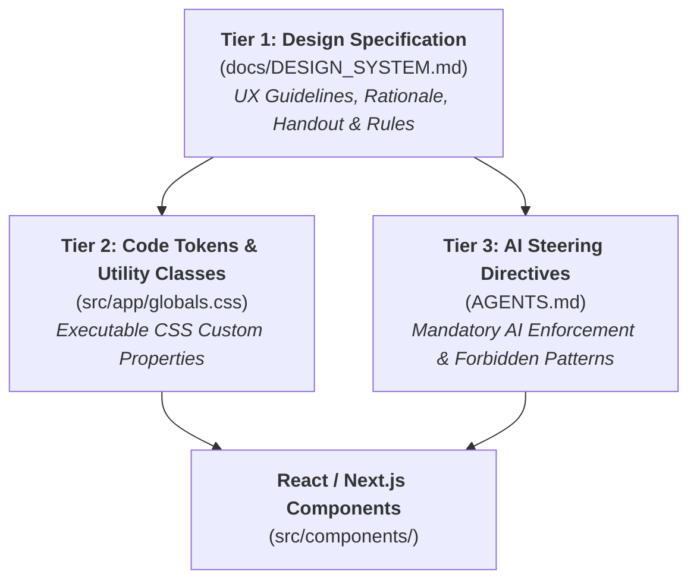
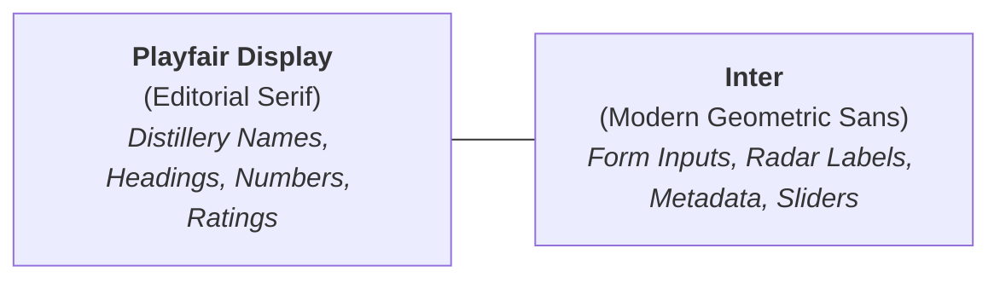

# 🎨 Aqua Vitaeum — Design System & Visual Specification

This document is the **Single Source of Truth (SSOT)** for all UI/UX design, visual aesthetics, color theory, typography pairings, elevation layers, and sensory matrices across **Aqua Vitaeum**.

---

## 🏛️ 1. Design Philosophy: The Master Distiller's Archival Atelier

Aqua Vitaeum is crafted around the sensory atmosphere of a **bespoke, warm archival spirits atelier**:

- **Warm Vintage Linen Canvas (`#ECE5D8`)**: Warm, unhurried, tactile natural paper base (~4% deeper saturation) ensuring 100% glare-free sunlight legibility and organic luxury depth.
- **Warm Antique Chamois Cards (`#F5EFE1`)**: Elevated chamois parchment canvas for cards, dialogs & panels, providing soothing, glare-free reading comfort in all lighting conditions (especially during evening tastings).
- **Deep Letterpress Walnut Ink (`#2B1E14`)**: High-contrast, authentic letterpress ink achieving a superior **13.5:1 WCAG AAA** contrast ratio across all parchment surfaces.
- **Calibrated Irish Clover Green (`#237347` / `#2E945D`)**: Fresh botanical highland clover accents for secondary branding, Glencairn placeholder badges, card header banners, and primary action triggers (`--fab-bg`).
- **Signature Clover Green Selection (`#2E945D`)**: High-contrast active selection for card borders, toggle pills, and navigation tabs.
- **Distiller's Amber-Copper (`#C97A1E` / `#FFD166`)**: Warm glowing pot-still copper highlights strictly reserved for rating stars, score medals, and hover title shimmer.

---

## 📐 2. Architecture: The 3-Tier Design System



| Tier | File | Purpose |
| :--- | :--- | :--- |
| **Spec & Handout** | `docs/DESIGN_SYSTEM.md` | Human-readable & UX agent guide with design theory, color codes, contrast, and recipes. |
| **Code Implementation** | `src/app/globals.css` | CSS Custom Properties (`:root` default / `[data-theme="pub-dark"]`) and compound utility classes. |
| **Agent Enforcement** | `AGENTS.md` | Mandatory steering directives preventing color drift and enforcing named token usage. |

---

## 🎨 3. Design Token Matrix

### 3.1 Canvas & Surfaces (2026 Unified Editorial Atelier)

| Token Name | Hex Value | Role & Surface |
| :--- | :--- | :--- |
| `--pub-bg` | `#ECE5D8` | Main app background, scrollable view areas (Warm Vintage Linen). |
| `--pub-bg-alt` | `#E0D5C1` | Secondary parchment depth, chips, and table headers. |
| `--pub-bg-panel` | `#F5EFE1` | Elevated cards, dialogs, and tasting card surfaces (Warm Antique Chamois). |
| `--nav-bg` | `#ECE5D8` | Seamless floating ultra-clean glassmorphism navigation bar surface. |
| `--nav-active` | `#2E945D` | Signature Irish Clover Green active navigation tab indicator. |
| `--nav-inactive` | `#8A7360` | Muted warm sepia slate for inactive navigation items. |
| `--wood-accent` | `#2E945D` | Clover green primary secondary and structural accent. |
| `--wood-dark` | `#237347` | Deep clover green tone. |
| `--wood-selection` | `#2E945D` | Signature Irish Clover Green for active pills, toggles, and card selection. |
| `--forest-green` | `#2E945D` | Vibrant Irish Clover green for badges, placeholders, and action triggers. |
| `--sensory-nose` | `#C97A1E` | Luminous Amber-Gold for Nose aroma radar layers and sliders. |
| `--sensory-taste` | `#1C6B7D` | Maritime Coastal Teal for Taste palate radar layers, sliders, and flavor tags. |
| `--foreground` | `#2B1E14` | Primary aged sepia ink text (13.5:1 AAA). |

### 3.2 Brass & Metallic Accents (Amber-Copper)

| Token Name | Hex Value | Role & Surface |
| :--- | :--- | :--- |
| `--brass-accent` | `#C97A1E` | Primary rating stars, medals, and score numbers (Amber-Copper). |
| `--brass-muted` | `#A66519` | Secondary brass subtitles and section eyebrow labels. |
| `--brass-light` | `#E59632` | Score highlights. |

### 3.3 Parchment Tasting Card & Ink

| Token Name | Hex Value / RGBA | Role & Surface |
| :--- | :--- | :--- |
| `--parchment-bg` | `#F5EFE1` | Tasting card body canvas (`.parchment`) in warm chamois cream. |
| `--parchment-bg-alt` | `#EAE1CE` | Alternate parchment depth for nested sections and chips. |
| `--parchment-border` | `#D0C2AB` | 1px bookbinder hairline rule and input underlines. |
| `--parchment-divider` | `rgba(35, 115, 71, 0.28)` | Clover Green tinted section divider lines. |
| `--sepia-text` | `#2B1E14` | Primary ink on parchment (14.2:1 AAA). |
| `--sepia-muted` | `#6D5949` | Placeholders, inactive items, secondary labels. |
| `--sepia-light` | `#8A6E55` | Section header labels. |

### 3.4 Floating Action Buttons (FABs) & Primary CTAs

| Token Name | Hex Value / RGBA | Role & Surface |
| :--- | :--- | :--- |
| `--fab-bg` | `#2E945D` | Primary action button / mobile FAB background (Irish Clover). |
| `--fab-bg-hover` | `#237347` | Primary action button hover background. |
| `--fab-text` | `#FDFBF7` | FAB icon and typography color (Crisp Ivory). |
| `--fab-border` | `rgba(255, 209, 102, 0.5)` | Subtle amber-gold ring outline on FABs. |

---

## 🔤 4. Typography Scale & Font Pairings

Aqua Vitaeum pairs an authentic editorial serif with a clean, high-legibility geometric sans-serif:



| Type Role | Font Family | Tailwind Class | Usage Guidelines |
| :--- | :--- | :--- | :--- |
| **Display Headings** | `Playfair Display` | `font-display font-bold text-[var(--foreground)]` | Main titles, journal names, bottle titles, score badges. |
| **Display Italic** | `Playfair Display` | `font-display italic` | Distillery subtitles, historical region notes, Latin quotes. |
| **Body & UI** | `Inter` | `font-body` | All form inputs, metadata details, paragraph text, tags. |
| **Micro Labels** | `Inter` | `font-body uppercase tracking-wider text-[11px]` | Form field uppercase headers (`FieldLabel`), rating sliders. |

### 4.1 Standardized 3-Tier Typographic Color System
1. **Tier 1 (Content Titles & Expression Names)**: Always Deep Bookbinder Walnut (`text-[var(--foreground)]` `#2B1E14`), shifting into Warm Gold on interactive hover (`group-hover:text-[var(--brass-accent)]`).
2. **Tier 2 (Structural Headers & Metadata Labels)**: Muted Antique Walnut (`text-[var(--sepia-muted)]` `#6D5949` or `text-[var(--sepia-light)]` `#8A6E55` with `uppercase tracking-wider font-bold`). Serves as a discreet structural guide without competing with content titles.
3. **Tier 3 (Interactive Accents & Badges)**: Luminous Amber-Copper (`text-[var(--brass-accent)]` `#C97A1E`) strictly reserved for active rating stars, score medals, and interactive highlights.

---

## ⚡ 5. Compound Utility Classes & Component Standards

### 5.1 Floating Action Button (`.btn-fab`)
Used for all desktop circular action buttons and mobile primary triggers:
```css
.btn-fab {
  background-color: var(--fab-bg);
  color: var(--fab-text);
  border: 1px solid var(--fab-border);
}
.btn-fab:hover {
  background-color: var(--fab-bg-hover);
}
```

### 5.2 Card Toggle Button (`.card-toggle`)
Used for segmented pills inside parchment tasting cards (e.g. Cask Strength, Natural Color, Finish Mode):
```css
.card-toggle {
  border-color: var(--parchment-border);
  background-color: rgba(43, 30, 20, 0.05);
  color: var(--sepia-muted);
}
.card-toggle:hover {
  background-color: rgba(43, 30, 20, 0.10);
}
.card-toggle[aria-pressed="true"] {
  background-color: var(--wood-selection);
  border-color: var(--wood-selection);
  color: var(--parchment-bg);
}
```

### 5.3 Parchment Underline Input (`.input-parchment`)
Used for all text inputs, textareas, and select elements on the parchment ledger:
```css
.input-parchment {
  background: transparent;
  border-bottom: 1px solid var(--parchment-border);
  color: var(--sepia-text);
}
.input-parchment::placeholder {
  color: var(--parchment-border);
}
.input-parchment:focus {
  border-bottom-color: var(--sepia-muted);
  outline: none;
}
```

### 5.4 Seamless Photo-to-Liquid Bar Transition (`SpiritCard`)
- **Edge-to-Edge Bottle Photo Showcase**: The bottle photograph attaches directly to the signature animated liquid shimmer ribbon with zero white gap line (`border-b` on the photo container is eliminated).
- **Subtle Lower Divider**: The liquid bar is bounded at the bottom with `border-b border-[var(--parchment-border)]/50` to separate cleanly from card text.

### 5.5 Selection & Multi-Delete Standard (Light-OS Standard)
- **Unselected Items**: Softly dimmed to `opacity-40 scale-[0.98]` (no dirty black overlays).
- **Selected Items**: 100% crystal clear (`opacity-100 scale-[1.02]`) with Warm Light Honey Oak border (`border-[var(--wood-selection)] ring-2 ring-[var(--wood-selection)]/45 shadow-[0_0_25px_rgba(179,137,93,0.3)]`) and ivory checkmark badge.
- **Prominent Action Buttons**: High-contrast red delete action button (`bg-red-600 hover:bg-red-700 text-white font-bold`) and ivory done button (`[✕ Fertig]`).
- **Header Transformation**: Top search bar automatically transforms into a selection mode status badge during active selection.

### 5.6 Content-Aligned 64px Desktop FABs
- **Ergonomic Sizing**: Large `w-16 h-16` circular action triggers with `size={28}` icons for comfortable desktop pointer interaction.
- **Outer Grid Anchorage**: Anchored directly outside the `max-w-6xl` content column (`right-4 xl:-right-10 2xl:-right-16` / `left-4 xl:-left-10 2xl:-left-16`), keeping CTAs perpetually accessible while maximizing reading canvas width.

### 5.7 Clover Green Header Banners & Table Thead
- **Journal Cards**: Compact `px-4 py-2.5 sm:py-3` banner in Deep Clover Green (`bg-[var(--wood-dark)]`) with prominent ivory title (`text-lg sm:text-xl font-bold text-[var(--parchment-bg)]`) and tight subtitle spacing (`mt-0.5`).
- **Matrix Table (`NoteTableView`)**: `<thead>` styled in signature Deep Clover Green (`bg-[var(--wood-dark)] border-b border-[var(--wood-dark)]/80`) with crisp ivory display text.
- **Card Footers (`SpiritCard`)**: Grounded with solid Clover Green status bar (`bg-[var(--wood-dark)] text-[var(--parchment-bg)]`) for regional provenance and date stamps.

### 5.8 Screen-Stable Page Actions Dropdown (`PageActionsDropdown`)
- **Discrete Action Trigger (`w-9 h-9`)**: Styled in warm chamois parchment (`bg-[var(--pub-bg-panel)] border-[var(--forest-green)]/35 text-[var(--forest-green)]`) with an intuitive Three-Dots (`MoreHorizontal` `•••`) icon and smooth active scale animation.
- **Pixel-Perfect Alignment**: Harmonized across Bookshelf, Journal Landing, and Detail Ledger views to eliminate visual jumping during navigation transitions.
- **Contextual Actions**: Centralizes bulk selection, single note/journal export (`.json`), file import, and destructive removal without visual clutter (distinct from app settings in the Profile tab).

### 5.9 Responsive Grid System & Photo Treatments
- **Smartphone Grid (`< 640px`)**: Strictly enforces **2 items per row** (`grid-cols-2`) with compact gaps (`gap-3`) for dense archival browsing.
- **Desktop Grid (`>= 1024px`)**: Capped at **4 columns** (`lg:grid-cols-4`) perfectly flush with the top AppHeader logo and user boundaries.
- **Subtle Image Vignette**: Replaced heavy dark shadows with an ultra-subtle, airy gradient (`from-black/20 to-transparent`, `h-5 sm:h-6`) preserving pristine glass clarity.

### 5.10 Glencairn Single-Mesh 3D Inset Logo
- **Crystal Wall Inset**: Scale factor `0.905` creating an authentic ~8px optical light gap between amber liquid and ivory glass contours.
- **Pure Vector Compliance**: 100% comment-free XML markup with explicit `width="512" height="512"` and standard XML prolog.

---

## 🍷 6. Instinctive Sensory Flavor Palette (SWRI Taxonomy)

Aqua Vitaeum maps flavor descriptors to human-instinctive colors based on natural cognitive associations:

| Dimension | Canonical Hex | Color Name | Sensory Association |
| :--- | :--- | :--- | :--- |
| **Peaty** | `#E65100` | Flame Ember | Peat smoke, campfire, kiln peat. |
| **Fruity** | `#D81B60` | Berry Crimson | Fresh orchards, berries, stone fruits. |
| **Floral** | `#8E24AA` | Lavender Violet | Heather, rosewater, blossoms. |
| **Spicy** | `#F57C00` | Warm Spice Amber | Cinnamon, clove, nutmeg, black pepper. |
| **Cereal** | `#C59B27` | Golden Malt | Barley, porridge, toasted oats. |
| **Woody** | `#6D4C41` | Toasted Oak | Virgin oak, cedarwood, cedar resin. |
| **Winey** | `#880E4F` | Sherry Burgundy | Oloroso, PX cask, port, dark raisins. |
| **Chocolate** | `#3E2723` | Dark Cocoa | Roasted cocoa nibs, espresso, fudge. |
| **Feinty** | `#00796B` | Waxen Teal | Beeswax, leather, tobacco pouch. |
| **Sulphury** | `#558B2F` | Mineral Olive | Gunpowder, matches, struck flint. |
| **Nutty** | `#795548` | Walnut Brown | Roasted hazelnut, almond, marzipan. |

---

## 🛡️ 7. Accessibility & Color Contrast Standards

All text color combinations are calibrated against **WCAG 2.2 Level AAA / AA**:

| Foreground Surface | Background Surface | Contrast Ratio | Rating |
| :--- | :--- | :--- | :--- |
| `--foreground` (`#2B1E14`) | `--pub-bg` (`#ECE5D8`) | **13.5 : 1** | Triple-A (AAA) |
| `--sepia-text` (`#2B1E14`) | `--parchment-bg` (`#F5EFE1`) | **14.2 : 1** | Triple-A (AAA) |
| `--sepia-muted` (`#6D5949`) | `--parchment-bg` (`#F5EFE1`) | **5.4 : 1** | Double-A (AA) |
| `--fab-text` (`#FDFBF7`) | `--fab-bg` (`#2E945D`) | **5.4 : 1** | Double-A (AA+) |
| `--parchment-bg` (`#F5EFE1`) | `--wood-selection` (`#2E945D`) | **4.6 : 1** | Double-A (AA) |

---

## 🚫 8. Implementation Rules for Contributors & AI Agents

1. **NEVER use raw hex codes** in component markup (e.g. `bg-[#C59B27]` is strictly prohibited).
2. **Always reference CSS custom properties** via Tailwind arbitrary token syntax: `bg-[var(--brass-accent)]` or `bg-[var(--wood-selection)]`.
3. **Use compound utility classes** (`.btn-fab`, `.card-toggle`, `.input-parchment`, `.parchment`) whenever applicable.
4. **Data-driven exceptions**: Flavor taxonomy colors (`spirit-flavor-taxonomy.ts`) and dynamic spirit color variables (`colourHex`) are data entities and may remain as dynamic values.
